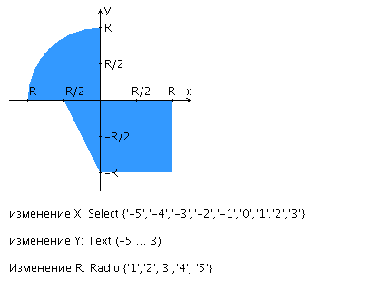

# Методы и средства программной инженерии. Лабораторная работа №3
Лабораторная работа заключается в написании сценария для утилиты
[Apache Ant](http://ant.apache.org/), реализующего компиляцию, тестирование и упаковку
в jar-архив кода проекта.

## Программа
Консольное приложение, выполненное по заданию
[Лабораторной работы №1](https://se.ifmo.ru/courses/web) варианта 286078.

Приложение реализует эмуляцию стрельбы в нарисованную ниже область


Для работы с приложением доступны следующие команды:
```text
    help                    Справка по командам
    shot [X] [Y] [R]        Выстрелить в область радиуса R по координатам X, Y
    history                 Список результатов предыдущих выстрелов
    exit                    Выйти из программы 
```

